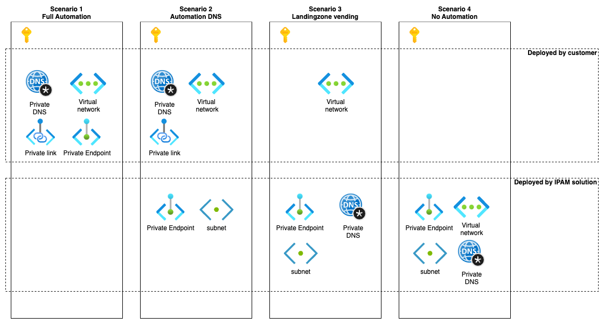

# Private Scenario's

## Scope

- Virtual network
- Private endpoints
- Private link
- Private DNS zones

## Design

The design has been crafted with the CAF archetypes and landing zone vending as its foundation, enabling deployment within either a corporate or online management group. This approach allows for flexible subscription deployment, with or without a virtual network (vnet). Considering these capabilities, I have developed four tiers of automation tailored to meet diverse customer needs. I am considering to remove the 4th one, because otherwirse you also need to implement some kind of connectivity resources. If we remove the 4th scenario, you always need a Virtual network deployed from the customer.

## Guides

Guides could contain PowerShell scripts that deploy the resources in the subscription.

1. How to create Private endpoints in another subscription
2. How to create Private DNS zone in another subscription

## References

- [CAF archetypes](https://learn.microsoft.com/en-us/azure/cloud-adoption-framework/ready/landing-zone/tailoring-alz)
- [Landing zone vending](https://learn.microsoft.com/en-us/azure/cloud-adoption-framework/ready/landing-zone/design-area/subscription-vending)
